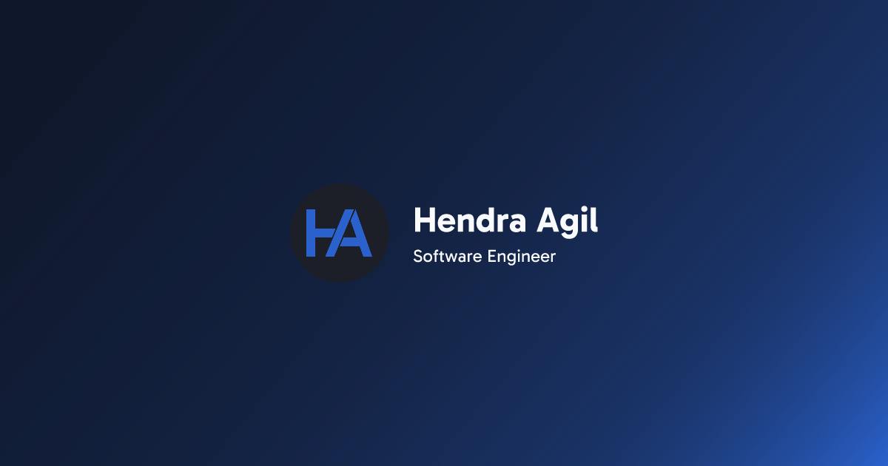

# hendraaagil.dev

[](https://hendraaagil.dev)

You can visit the old version in the repository [branches](https://github.com/hendraaagil/website/branches).

## Stack

- [Next.js 14 (App router)](https://nextjs.org/) - Full-stack React framework for the web.
- [Contentlayer](https://contentlayer.dev/) - Content SDK that validates and transforms content into type-safe JSON data.
- [Tailwind CSS](https://tailwindcss.com/) - Utility-first CSS framework.
- [shadcn/ui](https://ui.shadcn.com/) - Beautifully designed components built with Radix UI and Tailwind CSS.

## Local development setup

Node.js `>= 18.17` is required and setup with [pnpm](https://pnpm.io/) is recommended.

```sh
# duplicate & fill environment file
cp .env.sample .env.local

# install dependencies
pnpm i

# serve with hot reload at localhost:3000
pnpm dev

# build for production
pnpm build

# serve for production
pnpm start
```

## License

This source code is under the [GPL-3.0 License](LICENSE).
