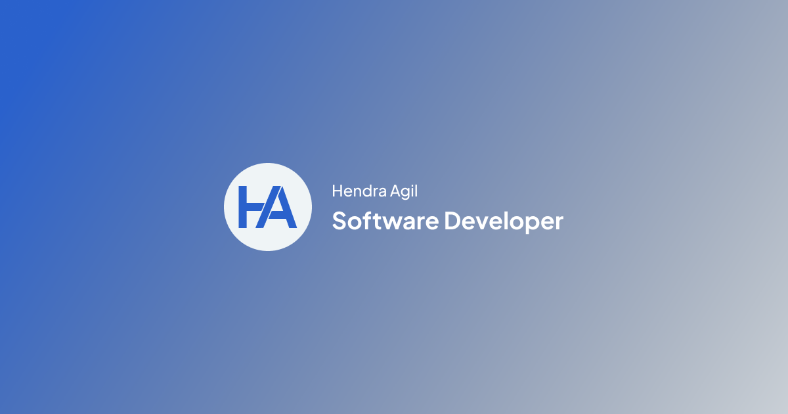

# hendraaagil.dev



## Developing

Node.js `>= 16.x` setup with [yarn](https://yarnpkg.com/) is recommended.

```bash
# duplicate & fill environment file
cp .env.example .env.local

# install dependencies
yarn

# serve with hot reload at localhost:3000
yarn dev

# build for production
yarn build
```

## Built with

- Framework - [**Next.js**](https://nextjs.org/)
- Styling - [**Tailwind CSS**](https://tailwindcss.com/)
- Fonts - [**Fontsource**](https://fontsource.org/)
- Icons - [**React Icons**](https://github.com/react-icons/react-icons)
- Data Fetching - [**SWR**](https://swr.vercel.app/)
- Comments - [**Giscus**](https://github.com/giscus/giscus)
- Analytics - [**Umami**](https://umami.is/)
- Deploy - [**Vercel**](https://vercel.com/)
- Others
  - Classname Utility - [**clsx**](https://github.com/lukeed/clsx)
  - Date Formatting - [**date-fns**](https://github.com/date-fns/date-fns)
  - Animation - [**framer-motion**](https://github.com/framer/motion)
  - Theme - [**next-themes**](https://github.com/pacocoursey/next-themes)
  - SEO - [**next-seo**](https://github.com/garmeeh/next-seo)
  - MDX - [**next-mdx-remote**](https://github.com/hashicorp/next-mdx-remote)
  - Hooks - [**react-use**](https://github.com/streamich/react-use)

## Credits

Thanks to my inspiration.

- [leerob.io](https://leerob.io/)
- [resir014.xyz](https://resir014.xyz/)

## License

This source code is under the [MIT License](LICENSE).
