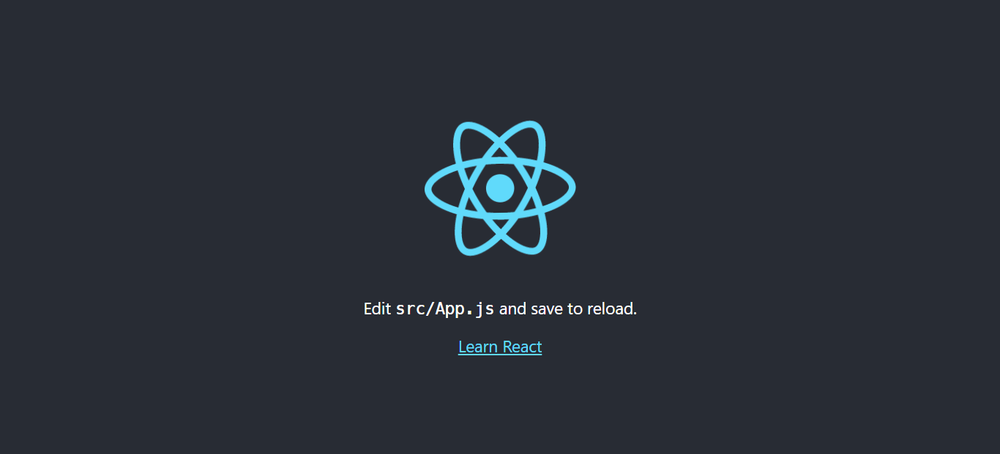

## Apa Itu React?

Sebelum memulai belajar kita harus kenalan dulu, React itu apa sih?

[React](https://reactjs.org/) adalah library JavaScript untuk membangun antarmuka pengguna yang dibuat oleh [Facebook](https://github.com/facebook). React memudahkan kita untuk membangun sebuah website dengan fitur SPA (Single Page Application). Dengan fitur SPA tentu akan meningkatkan performa website, kita hanya perlu mengganti data yang tampil jika ingin berpindah halaman bukan memberikan halaman baru kepada pengguna.


Walau cukup sering disebut sebagai framework, React sendiri sebenarnya adalah library seperti yang disebutkan pada websitenya. Karena React tidak memiliki aturan tersendiri pada penggunaannya. Seperti struktur folder project yang React sendiri tidak memberikan aturan khusus, hanya memberikan [rekomendasi](https://reactjs.org/docs/faq-structure.html). Kalau di website [ini](http://react-file-structure.surge.sh/) mengatakan "move files around until it feels right" 😄.

## Menggunakan React

Untuk menggunakan React di project kita, bisa lewat tag `script` dan mulai membuat React component. Lebih lanjutnya bisa cek di [dokumentasinya](https://reactjs.org/docs/add-react-to-a-website.html).

### Membuat Project Baru

Pada blog ini, kita hanya akan menggunakan [CRA (Create React App)](https://create-react-app.dev/) untuk membuat project baru dengan React. Kita bisa jalankan perintah `npx create-react-app my-app` atau `yarn create react-app my-app` jika menggunakan [yarn](https://yarnpkg.com/).

Kita akan coba membuat project React dengan nama **my-react-app**. Saya akan menggunakan yarn, maka jalankan perintah `yarn create react-app my-react-app` dan tunggu sampai project selesai dibuat. Jika sudah selesai, maka tampilan terminal akan seperti berikut:


CRA sudah menyediakan [struktur folder](https://create-react-app.dev/docs/folder-structure/) dan beberapa package tambahan di project React kita. Jika kita coba jalankan projectnya dengan perintah `yarn start`, maka akan tampil seperti berikut:



Kita akan coba ke file `src/App.js`.

```js showLineNumbers
import logo from './logo.svg'
import './App.css'

function App() {
	return (
		<div className="App">
			<header className="App-header">
				
				<p>
					Edit <code>src/App.js</code> and save to reload.
				</p>
				<a
					className="App-link"
					href="https://reactjs.org"
					target="_blank"
					rel="noopener noreferrer"
				>
					Learn React
				</a>
			</header>
		</div>
	)
}

export default App
```

File `App.js` ini bisa disebut sebagai parent bagi semua komponen nantinya, sedangkan rootnya ada di file `index.js`. Di folder `src` juga ada beberapa file tambahan seperti `App.test.js` dan `setupTests.js` yang berfungsi jika kita akan menggunakan testing pada React.

Untuk kali ini, kita hanya belajar dasarnya saja. Jadi, kita coba langsung untuk menghapus semua teks pada `App.js` dan sisakan logonya. Maka file `App.js` akan seperti berikut:

```js showLineNumbers
import logo from './logo.svg'
import './App.css'

function App() {
	return (
		<div className="App">
			<header className="App-header">
				
			</header>
		</div>
	)
}

export default App
```

Sintaks di dalam blok `return` diatas disebut sebagai [JSX](https://reactjs.org/docs/introducing-jsx.html), dia mirip seperti HTML tapi kita bisa berikan nilai dinamis didalamnya. Sebagai contoh kita coba tambahkan nama kita dibawah logo:

```js
...

function App() {
  const name = 'Hendra Agil';

  return (
    ...
      
      <p>Hi, my name is {name}</p>
    ...
  );
}
```

Maka nama kita akan tampil, seperti berikut:


### Menggunakan State

Ada kemungkinan kita ingin menampilkan nilai yang lebih dinamis atau bisa berubah - ubah. Untuk itu kita bisa menggunakan **state**. Pada React versi 16.8 ke bawah, state hanya bisa digunakan pada class component. Tapi setelah adanya update pada versi 16.8 ke atas, React memperkenalkan [hooks](https://reactjs.org/docs/hooks-intro.html).

#### Apa Itu Hooks?

[Hooks](https://reactjs.org/docs/hooks-intro.html) bisa digunakan untuk deklarasi dan modifikasi state di functional component. Untuk itu, kita bisa gunakan `useState`. Sebagai contoh, kita akan membuat state `count` dan dia akan bertambah saat kita klik pada sebuah button.

Maka kita perlu import `useState` dan deklarasi state-nya terlebih dahulu:

```js
import { useState } from 'react';
...

function App() {
  const [count, setCount] = useState(0);
  ...
}
```

Disitu ada `count` yaitu nilai state itu sendiri dan ada `setCount` yang akan kita gunakan untuk merubah nilai pada state `count`. Nilai 0 pada parameter `useState` adalah nilai awal state tersebut.

Kita akan tambahkan button untuk melakukan perubahan state dan sedikit teks untuk menampilkan state `count` tadi:

```js
...

function App() {
  ...
  return (
    ...
      <p>You clicked the button {count} times</p>
      <button onClick={() => setCount(count + 1)}>Click Me!</button>
    ...
  );
}
```

Disitu kita menambahkan event `onClick` pada button dan menggunakan `setCount` untuk menambah nilai pada state `count`. Jika dijalankan maka hasilnya akan seperti berikut:


#### Lebih Lanjut Tentang Hooks

Hooks sendiri bukan hanya digunakan untuk state, tapi juga bisa menggantikan component lifecycle seperti `componentDidMount`, `componentDidUpdate`, dll. yang awalnya hanya ada pada class component dengan menggunakan [`useEffect`](https://reactjs.org/docs/hooks-effect.html).

Masih ada juga beberapa hooks tambahan yang disediakan oleh React, bisa dibaca saja di [sini](https://reactjs.org/docs/hooks-reference.html). Jika dirasa hooks yang tersedia masih kurang atau tidak sesuai kebutuhan, kita bisa membuat [custom hooks](https://reactjs.org/docs/hooks-custom.html). Yaitu membuat hooks versi kita sendiri yang tentunya bisa menyesuaikan kebutuhan kita.

## Penutup

Sepertinya itu dulu untuk blog kali ini. Untuk beberapa topik seperti props, routing, dll. mungkin akan saya bahas di blog selanjutnya atau kalian bisa pelajari sendiri dari beberapa list tutorial berikut:

- [Dokumentasi React](https://reactjs.org/)
- [Dokumentasi React (Bahasa Indonesia)](https://id.reactjs.org/)
- [Dokumentasi Create React App](https://create-react-app.dev/)
- [Rekomendasi Sumber Belajar dari ReactJS Indonesia](https://reactjs.id/learning)
- [Full Modern React Tutorial dari The Net Ninja](https://www.youtube.com/playlist?list=PL4cUxeGkcC9gZD-Tvwfod2gaISzfRiP9d)

Terima kasih sudah membaca blog saya, selamat belajar! Semoga bermanfaat.
