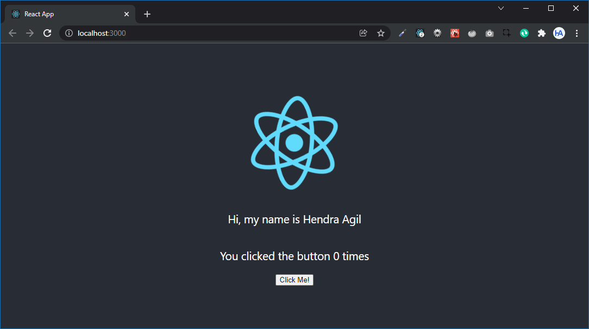
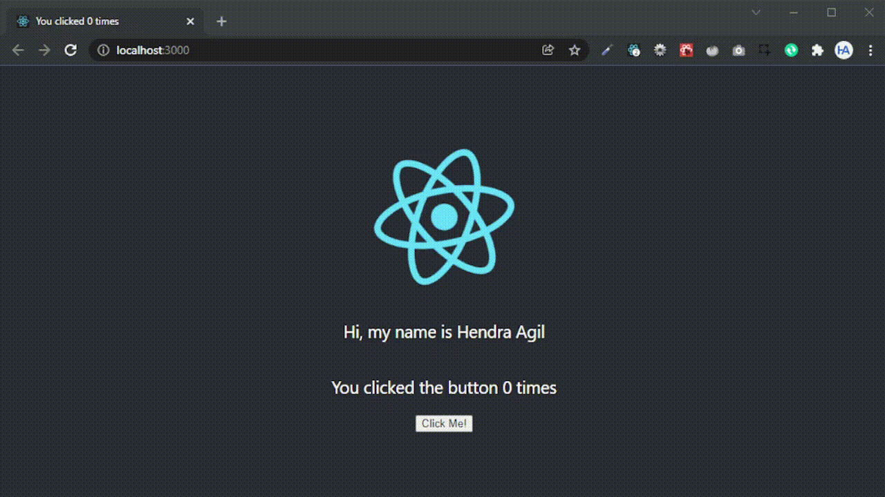
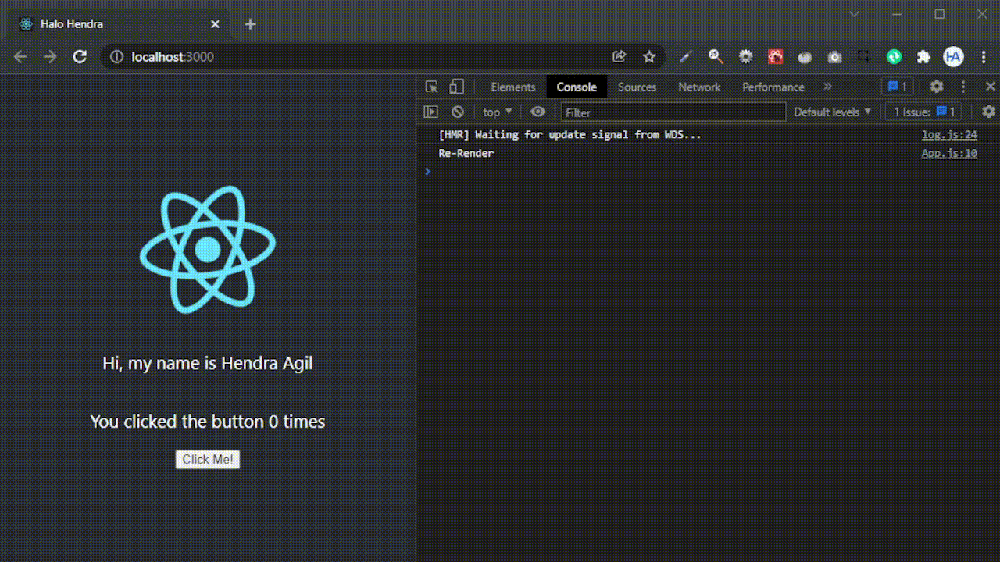

## Apa Itu useEffect

**useEffect** adalah salah satu hooks yang mulai diperkenalkan di React versi `>= 16.8`. Jika kalian pernah belajar class component di React, `useEffect` ini memiliki fungsi yang mirip atau bisa dibilang sama dengan `componentDidMount`, `componentDidUpdate` dan `componentWillUnmount`.

## Contoh Penggunaan

Hooks `useEffect` ini akan berjalan saat pertama render dan saat terdapat sebuah re-render / pembaruan di komponennya. Sebagai contoh, kita akan melanjutkan project di blog [ini](/blog/berkenalan-dengan-react-basic) kemarin.

Saat ini memiliki tampilan seperti berikut:



Kita bisa coba menambahkan kode `useEffect` untuk mengubah title dari website tadi:

```js
import { useEffect, useState } from 'react';
...

function App() {
  const [count, setCount] = useState(0);
  const name = 'Hendra Agil';

  useEffect(() => {
    document.title = `You clicked ${count} times`;
  });

  return (
    ...
  );
}

export default App;
```

Dari kode tersebut, kita memanggil sebuah hooks `useEffect` dan memasukkan sebuah anonymous function di dalamnya yang akan dieksekusi oleh `useEffect` tadi. Function tersebut akan mengubah title dari halaman website kita melalui [Document API](https://developer.mozilla.org/en-US/docs/Web/API/Document).

Hasilnya akan seperti berikut:



Contoh sederhana penggunaan `useEffect` adalah seperti tadi. Namun, bagaimana jika kita hanya ingin menggunakan `useEffect` saat pertama kali komponen itu dirender saja? 🤔

Sebagai contoh kasus, kita ingin mengambil data dari sebuah API. Tentu saja kita hanya akan mengambil data itu satu kali saja saat halaman pertama kali dibuka.

Tapi di contoh kali ini kita akan coba hal sederhana, yaitu untuk update title dari website kita tadi. Kita coba ubah kode `useEffect` tadi menjadi seperti berikut:

```js
...
  useEffect(() => {
    document.title = `Halo Hendra`;
  });
...
```

Jika kita cek, sudah benar dia mengupdate title dari website kita:


Namun, jika kita coba tambahkan kode `console.log` seperti ini:

```js
...
  useEffect(() => {
    console.log('Re-Render');
    document.title = `Halo Hendra`;
  });
...
```

Kita coba cek di console browser saat kita mengklik button:



Tulisan **Re-Render** tadi muncul di console sebanyak kita mengklik button tadi.

Itu terjadi karena setiap kita mengklik button tadi, dia mengupdate state `count` dan melakukan render ulang / re-render di halaman yang kita akses. Sebagai solusinya kita bisa memberikan params kedua yang berupa array di `useEffect` tadi.

Jika kita hanya ingin mengeksekusinya saat pertama kali render, kita bisa menggunakan array kosong sebagai params kedua:

```js
...
  useEffect(() => {
    console.log('Re-Render');
    document.title = `Halo Hendra`;
  }, []);
...
```

Kita coba jalankan:


Tulisan **Re-Render** hanya muncul sekali di console browser kita. Berarti fungsi di `useEffect` tadi hanya dijalankan ketika halaman pertama kali dibuka. Yeay! 🥳

### Penggunaan Lanjutan

Penggunaan `useEffect` ini sebenarnya bisa lebih sakti lagi, bukan hanya untuk update elemen DOM seperti yang kita lakukan tadi. Kita bisa melakukan fetch API di dalam fungsi `useEffect` dan mengupdate data state untuk nantinya dirender ke halaman website kita.

Di penggunaan yang lebih lanjut lagi, kita bisa menggunakan `useEffect` sebagai pengganti `componentWillUnmount` di class component dengan menggunakan fungsi `cleanup()` untuk melakukan pembersihan.

## Penutup

Mungkin cukup itu sedikit perkenalan tentang `useEffect` di React. Jika kalian ingin mempelajari lebih lanjut bisa lewat sumber berikut:

- [Dokumentasi React Tentang useEffect](https://reactjs.org/docs/hooks-effect.html)

Terima kasih sudah membaca blog ini, tetap semangat belajar! Semoga bermanfaat.
