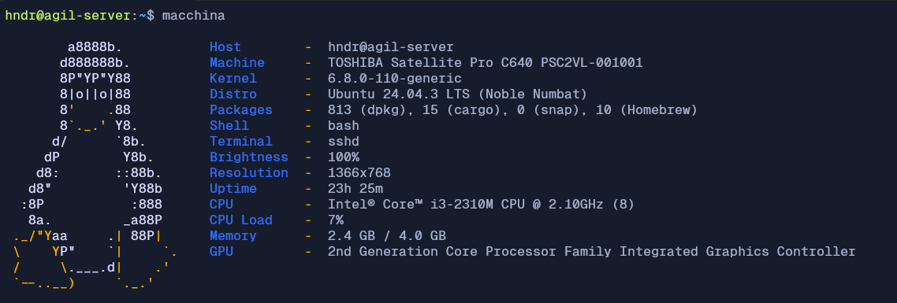
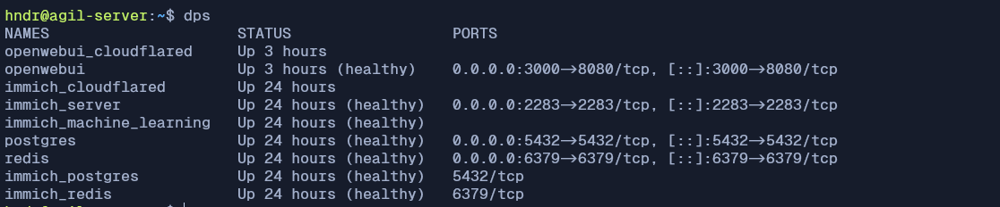
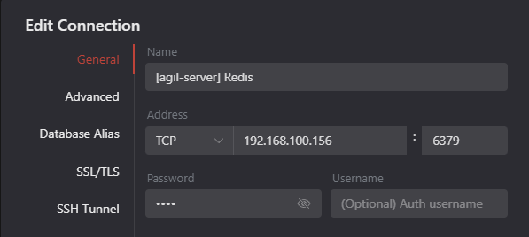
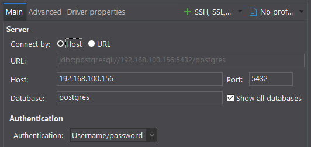
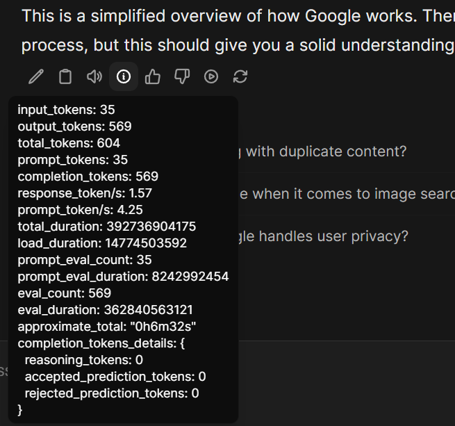

Tidak terasa 2026 sudah sampai di bulan Mei dan ini adalah tulisan pertama di tahun ini. Kali ini aku akan sedikit berbagi tentang pengalaman mencoba setup "home server" untuk berbagai kebutuhan pribadi aku.

---

## Inisiasi

Ide untuk coba-coba setup server ini muncul ketika melihat sebuah laptop lama (TOSHIBA Satellite Pro C640) yang dulu dipakai kakak aku, juga dipakai untuk bermain game PES di jamannya 😅

Spesifikasi awalnya kalau tidak salah: 320GB storage, 1GB RAM, dan CPU Intel i3-2310M. Waktu itu storage-nya sudah diambil dan belum bisa dipakai lagi. Jadi, di akhir tahun kemarin aku beli 4GB RAM DDR3 1333 MHz dan juga SSD SATA 120GB. Setelah aku pasang dan coba booting lewat flashdrive terlebih dahulu, berhasil nyala. Awalnya aku coba boot ke OS [Lubuntu](https://lubuntu.me/) lumayan berat, akhirnya aku ganti saja ke OS Ubuntu server 24.04 dan install ke storage-nya. Jadi, sekarang spesifikasinya seperti berikut:



Sampai tulisan ini dibuat, ada beberapa service yang sudah aku coba jalankan di server:



---

## Proses Setup

Karena aku melakukan setup ini sudah beberapa bulan yang lalu, jadi mungkin akan ada yang terlewat 😄🙏

### Instalasi Docker

Untuk menjalankan banyak service di mesin yang sama, aku pilih menggunakan Docker karena sudah cukup familiar. Instalasinya juga cukup mudah, tinggal mengikuti dokumentasi yang sudah ada:

<LinkPreview href="https://docs.docker.com/engine/install/ubuntu/" />

Aku juga selalu menggunakan Docker compose agar terdokumentasi dengan baik.

### Instalasi Database

Ini sebenarnya hanya untuk penggunaan pribadi saja, supaya sedikit tidak membebani mesin yang dipakai untuk bekerja. Jadi, untuk eksperimen / local database aku menggunakan dari server ini. Sampai saat ini baru menjalankan 2 server database: Redis dan PostgreSQL, dengan file Docker compose kurang lebih seperti berikut:

```yml
services:
  postgres:
    image: postgres:17-alpine
    container_name: postgres
    ports:
      - '5432:5432'
    volumes:
      - postgres-data:/var/lib/postgresql/data
    environment:
      POSTGRES_USER: ${POSTGRES_USER}
      POSTGRES_PASSWORD: ${POSTGRES_PASSWORD}
      POSTGRES_DB: ${POSTGRES_DB}
    mem_limit: 512m
    healthcheck:
      test: ['CMD-SHELL', 'pg_isready -U ${POSTGRES_USER} -d ${POSTGRES_DB}']
      interval: 30s
      timeout: 10s
      retries: 3
    restart: unless-stopped

  redis:
    image: redis:8.6-alpine
    container_name: redis
    ports:
      - '6379:6379'
    volumes:
      - redis-data:/data
    command: redis-server --requirepass ${REDIS_PASSWORD} --appendonly yes --maxmemory 512mb --maxmemory-policy allkeys-lru
    env_file:
      - .env
    mem_limit: 512m
    healthcheck:
      test: ['CMD', 'redis-cli', '-a', '${REDIS_PASSWORD}', 'ping']
      interval: 30s
      timeout: 10s
      retries: 3
    restart: unless-stopped

volumes:
  postgres-data:
  redis-data:
```

Untuk mengaksesnya sangat mudah, tinggal arahkan saja host-nya ke local IP dari server-nya. Karena di sini antara client & server masih di network yang sama.

| Koneksi Redis                      | Koneksi PostgreSQL                     |
| ---------------------------------- | -------------------------------------- |
|  |  |

Kemarin juga sempat eksplorasi cara agar kedua database ini bisa diekspos ke luar local network. Di sini aku menemukan [Tailscale](https://tailscale.com/). Dia berfungsi sebagai tunnel yang menghubungkan antara server database dan client yang membutuhkan koneksi ke databasenya. Cuma ini sifatnya peer-to-peer jadi server & client harus menjalankan service Tailscale di saat yang bersamaan.

### Instalasi Immich

[Immich](https://immich.app/) adalah Google Photos versi self-hosted, ini belum aku pakai sebagai primary backup karena masih punya subscription Google One 😅

Untuk instalasinya tinggal mengikuti dari dokumentasinya:

<LinkPreview href="https://docs.immich.app/install/docker-compose/" />

Di situ sudah disediakan template Docker compose serta value .env yang dibutuhkan. Untuk Immich ini aku juga pasangkan [Cloudflare tunnel](https://developers.cloudflare.com/cloudflare-one/networks/connectors/cloudflare-tunnel/) (cloudflared) agar bisa diakses lewat global network dan domain aku sendiri. Saat ini aku pasangkan ke domain [photos.hndr.xyz](https://photos.hndr.xyz).

Cloudflared ini bisa langsung ditambahkan ke file Docker compose:

```yml
services:
  immich-server:
    ...

  ...

  cloudflared:
    image: cloudflare/cloudflared:latest
    container_name: immich_cloudflared
    restart: unless-stopped
    command: tunnel --no-autoupdate run --token ${CLOUDFLARE_TUNNEL_TOKEN}
    depends_on:
      - immich-server

...
```

### Instalasi Open WebUI

Ini hanya iseng coba-coba aja karena spesifikasi servernya akan sangat keberatan untuk menjalankan sebuah model 😂

Sebelum melakukan instalasi ini, aku install [Ollama](https://ollama.com/download/linux) terlebih dahulu. Baru setelah itu menambahkan file Docker compose untuk Open WebUI beserta cloudflared agar bisa diakses di [llm.hndr.xyz](https://llm.hndr.xyz/):

```yml
services:
  openwebui:
    image: ghcr.io/open-webui/open-webui:main-slim
    container_name: openwebui
    restart: unless-stopped
    ports:
      - '3000:8080'
    environment:
      - OLLAMA_BASE_URL=http://host.docker.internal:11434
    extra_hosts:
      - 'host.docker.internal:host-gateway'
    volumes:
      - open-webui:/app/backend/data

  cloudflared:
    image: cloudflare/cloudflared:latest
    container_name: openwebui_cloudflared
    restart: unless-stopped
    command: tunnel --no-autoupdate run --token ${CLOUDFLARE_TUNNEL_TOKEN}
    depends_on:
      - openwebui

volumes:
  open-webui:
```

Bisa dilihat di sini responnya sangat cepat bukan? 🤣

<div className="max-w-lg"></div>

### Final Direktori

Instalasi ketiga service tadi aku kumpulkan ke 1 folder `apps` dan struktur direktorinya kurang lebih seperti berikut:

```
apps/
├── database-server
│   └── compose.yml
├── immich
│   └── docker-compose.yml
└── open-webui
    └── compose.yml
```

---

## Akses Remote SSH

Oh iya, semua proses tadi tidak aku lakukan langsung lewat laptop server. Tapi aku remote dari SSH lewat WSL di mesin utama. Seharusnya secara default server SSH sudah ada dan jalan di server, bisa diverifikasi melalui perintah:

```sh
sudo systemctl status ssh
```

Untuk akses dari WSL kita bisa semudah menggunakan perintah `ssh hndr@192.168.x.x` lalu nanti akan diminta password dari username `hndr`.

Atau jika ingin lebih aman bisa menggunakan identity file (private key). Caranya kurang lebih seperti berikut:

1. Generate SSH key baru: `ssh-keygen -t ed25519 -C "isi-comment"`
2. Masukkan public key ke `~/.ssh/authorized_keys` di server tujuan
3. Akses melalui WSL: `ssh -i ~/path-to/identity-file hndr@192.168.x.x`

### SSH Config

Jika kita punya banyak akses server dan tidak ingin menghafal setiap IP servernya, bisa membuat file config di `~/.ssh/config` seperti berikut:

```
Host agil-server
    HostName 192.168.x.x
    User hndr
    IdentityFile ~/path-to/identity-file

Host xxx
    HostName 10.x.x.x
    User root
    IdentityFile ~/path-to/identity-file
```

Sehingga kita bisa akses hanya dengan perintah: `ssh agil-server`.

---

## Penutup

Cukup sampai di sini saja untuk bagian 1 😁

Apakah akan ada bagian 2? Kita lihat saja nanti. Yang jelas masih banyak yang bisa dieksplorasi. Aku juga berencana untuk memindahkan beberapa service "mainan" yang ada di cloud server ke "home server" ini, karena kebetulan bulan depan (Juni) sudah habis masa kontrak servernya.

Tapi "home server" ini juga ada kelemahan karena sangat bergantung pada kondisi listrik di rumah yang saat ini belum ada backup-nya sama sekali, karena baterai laptop yang dipakai sebagai server juga sudah tidak berfungsi lagi 😅

Jika ada tambahan atau ada yang terlewat silakan disampaikan. Terima kasih 👋
