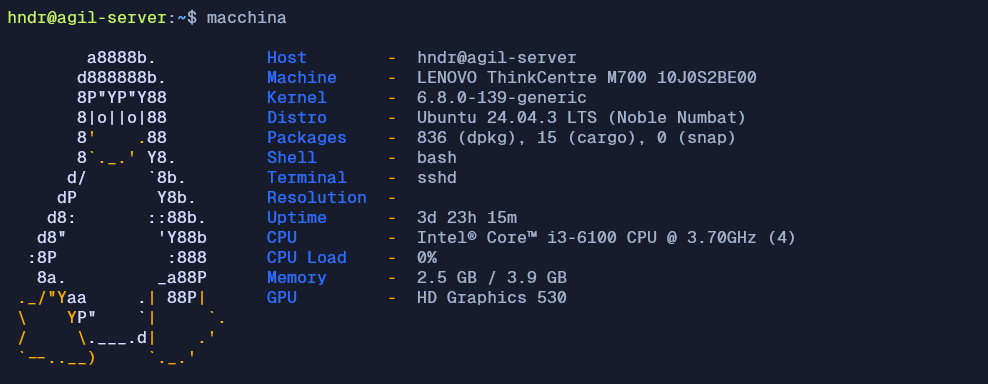
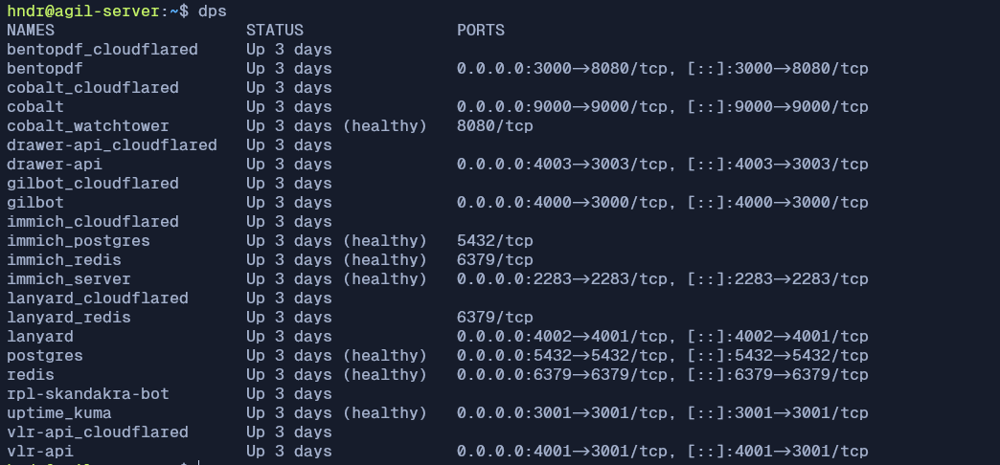
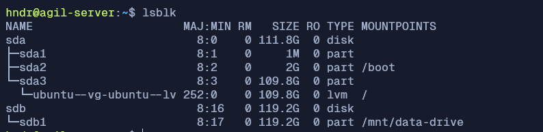
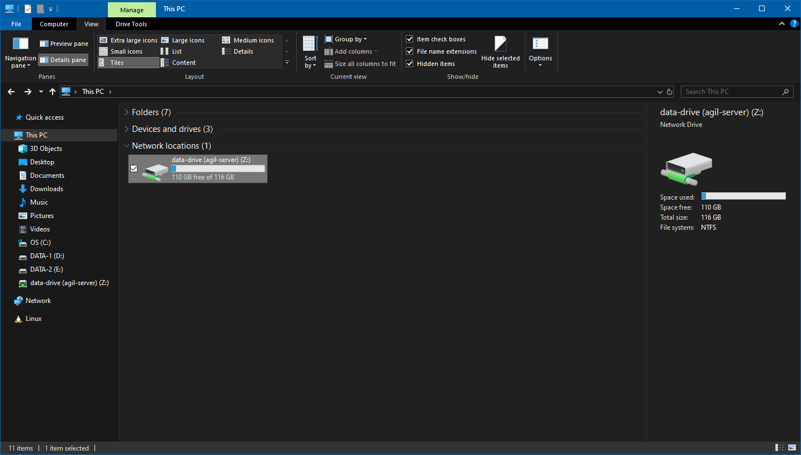

Setelah kemarin sudah bermain-main dengan home server di tulisan ini:

- [Bermain Home Server / Bagian 1](/blog/bermain-home-server-1)
- [Bermain Home Server / Bagian 2](/blog/bermain-home-server-2)

Sekarang aku "dipaksa" untuk bermain lagi, karena ada masalah baru yang muncul.

---

## Mesin Sudah Menyerah

Di tulisan sebelumnya, aku ceritakan kalau home server ini hanya memanfaatkan laptop bekas yang sudah tidak terpakai. Namun, ada masa di mana laptop tersebut tiba-tiba mati dan semua service tidak bergerak. Server tidak bisa diakses, baik melalui SSH ataupun di fisik laptop tersebut saat aku mencoba login ke dalam server.

Pada akhirnya, aku coba force-restart laptop dengan menekan tombol power. Namun, terdengar bunyi bip dari laptop tersebut. Sebagai alumni SMK jurusan RPL dan dulu ada praktik merakit komputer, aku harusnya bisa mengenali bunyi bip ini. Tapi apa daya ingatanku yang hanya sependek itu. Akhirnya aku cari tau di internet, apa penyebab dari bunyi bip itu.

Setelah aku cari, ternyata kemungkinan ada pada port RAM atau komponen RAM itu sendiri. Lalu aku coba bersihkan komponen RAM-nya dan aku coba pasang kembali. Setelah itu aku nyalakan dan bunyi bip itu masih ada. Sehingga laptop tidak mau boot ke OS Ubuntu.

---

## Mengganti Mesin

Setelah berpikir cukup panjang. Akhirnya aku memutuskan untuk coba membeli mini PC ThinkCentre seharga 1 jutaan. Tapi ada satu kelalaian, harusnya aku beli yang versi tanpa SSD. Karena saat ini SSD sudah menumpuk sebanyak ini 😀

<LinkPreview
	href="https://x.com/hendraaagil/status/2094039800475234623"
	withImage
	fullImage
/>

Tapi tidak apa-apa, ada pepatah mengatakan "Lebih baik menyesal beli, daripada menyesal tidak beli". Apalagi sekarang harga SSD lagi naik berkali-kali lipat. Jadi lumayan tumpukan SSD itu bisa jadi backup sewaktu dibutuhkan nanti, hehe.

### Memasang OS Ubuntu

Singkat cerita, mini PC sudah sampai dan siap menggantikan laptop yang sebelumnya digunakan. Di PC tersebut sudah terinstall OS Windows 10, yang tentu saja langsung aku ganti dengan Ubuntu server. Spesifikasinya seperti berikut:



Kurang lebih memang hampir sama dengan laptop sebelumnya.

### Migrasi Service

Migrasi ini tidak terlalu rumit, hanya sedikit memakan waktu saja. Beberapa service sudah terdokumentasi di GitHub, jadi aku tinggal clone ulang saja. Service lain yang belum terdokumentasi, terpaksa aku harus ambil dari SSD yang ada di laptop. Jadi, aku sambungkan ke storage enclosure dan masuk ke PC melalui port USB. Beberapa juga tercatat di tulisanku sebelumnya, jadi tinggal dicontek saja.

Service yang tidak terpakai juga aku drop, seperti [Ollama](https://ollama.com/). Karena terlalu memakan banyak resource, juga tidak ideal untuk spesifikasi server saat ini.

Pada akhirnya, semua service berhasil jalan kembali 🥳



#### PDF Tools

Ada 1 service yang baru, yaitu [BentoPDF](https://www.bentopdf.com/docs/). Software yang cukup berguna, karena aku cukup sering membutuhkan merge, split, ataupun sign PDF. Daripada menggunakan software online yang kita tidak tau kemana file kita akan dibawa. Atau menggunakan software berbayar seperti FoxitPDF.

BentoPDF ini sepenuhnya jalan di browser, jadi tidak disimpan ke server sama sekali. Jika kalian juga mau pakai tanpa ribet-ribet deploy sendiri. Aku sudah publish juga di domain [pdf.hndr.xyz](https://pdf.hndr.xyz/). Harusnya akan selalu bisa diakses, kecuali server mati lagi 😅

---

## Memanfaatkan SSD

Karena aku menjalankan service [Immich](https://immich.app/), aku pisahkan penyimpanannya ke SSD yang lain. Di sini aku hanya menggunakan enclosure eksternal yang menyambung ke port PC menggunakan USB. Lalu, di konfigurasi `.env` tinggal aku atur menjadi:

```sh
# The location where your uploaded files are stored
UPLOAD_LOCATION=/mnt/data-drive/immich/upload

# The location where your database files are stored. Network shares are not supported for the database
DB_DATA_LOCATION=/mnt/data-drive/immich/postgres
```

Oh iya, SSD ini sudah aku atur agar selalu ter-mount ke path `/mnt/data-drive`. Jadi, susunan penyimpanan di server saat ini seperti berikut:



### Konfigurasi Network Drive

Penyimpanan `/mnt/data-drive` ini juga bisa diakses melalui mesin utama, yaitu Windows dengan menambahkan Network Drive. Agar bisa diakses melalui network yang sama, aku menggunakan [samba](https://ubuntu.com/tutorials/install-and-configure-samba#1-overview). Karena sudah cukup "malas", jadi aku meminta Claude membuatkan script instalasinya:

```sh
#!/bin/bash
#
# One-time Samba setup script for sharing /mnt/data-drive
# Run with: sudo bash setup-samba.sh
#

set -e

# ==== CONFIG (edit if needed) ====
SHARE_NAME="data-drive"
SHARE_PATH="/mnt/data-drive"
SMB_USER="hndr"
CONF_FILE="/etc/samba/smb.conf"
# ==================================

if [ "$EUID" -ne 0 ]; then
  echo "Please run this script with sudo: sudo bash setup-samba.sh"
  exit 1
fi

if [ ! -d "$SHARE_PATH" ]; then
  echo "Error: $SHARE_PATH does not exist. Aborting."
  exit 1
fi

echo "==> Installing Samba..."
apt update -y
apt install -y samba

echo "==> Backing up existing smb.conf (if not already backed up)..."
if [ ! -f "${CONF_FILE}.bak" ]; then
  cp "$CONF_FILE" "${CONF_FILE}.bak"
fi

echo "==> Checking if share [$SHARE_NAME] already exists in smb.conf..."
if grep -q "^\[$SHARE_NAME\]" "$CONF_FILE"; then
  echo "Share [$SHARE_NAME] already exists in $CONF_FILE, skipping append."
else
  echo "==> Adding share [$SHARE_NAME] to $CONF_FILE..."
  cat >> "$CONF_FILE" <<EOF

[$SHARE_NAME]
   path = $SHARE_PATH
   browseable = yes
   read only = no
   guest ok = no
   valid users = $SMB_USER
   create mask = 0664
   directory mask = 0775
EOF
fi

echo "==> Ensuring system user '$SMB_USER' exists..."
if ! id "$SMB_USER" &>/dev/null; then
  echo "Error: system user '$SMB_USER' does not exist. Create it first with 'adduser $SMB_USER', then re-run this script."
  exit 1
fi

echo "==> Setting Samba password for user '$SMB_USER'..."
echo "You will be prompted to set a Samba password (can be different from the Linux login password)."
smbpasswd -a "$SMB_USER"
smbpasswd -e "$SMB_USER"

echo "==> Restarting Samba services..."
systemctl restart smbd
systemctl enable smbd

echo "==> Testing smb.conf syntax..."
testparm -s

IP_ADDR=$(hostname -I | awk '{print $1}')

echo ""
echo "================================================="
echo " Samba setup complete!"
echo ""
echo " Access from Windows File Explorer:"
echo "   \\\\${IP_ADDR}\\${SHARE_NAME}"
echo ""
echo " Login with:"
echo "   Username: $SMB_USER"
echo "   Password: (the one you just set)"
echo "================================================="
```

Dengan begitu, aku bisa dengan mudah mengaksesnya melalui file explorer dan menyimpan file apapun ke dalam path `/mnt/data-drive`.



---

## Penutup

Seharusnya cukup sampai di sini masalah mainan servernya. Kecuali jika ada sesuatu yang baru menghampiri lagi, hehe. Tapi, aku jadi penasaran. Apakah network drive ini bisa dipakai sejauh untuk menyimpan instalasi game melalui Steam? 🤔

Well, itu cerita lain lagi. Terima kasih dan sampai bertemu di tulisan berikutnya! 👋
