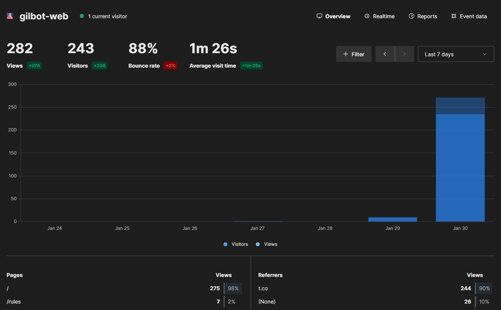

GilBot adalah sebuah bot WhatsApp yang saya buat ketika ada waktu luang dan ingin digunakan untuk mengetik kode. Kebetulan pada saat itu ada kartu SIM yang tidak terpakai, jadi saya daftarkan nomornya ke WhatsApp dan mencoba untuk membuat bot tersebut. Bot ini awalnya hanya saya bagikan ke status WhatsApp dan story Instagram sekitar tanggal 30 Mei 2023 (berdasarkan tanggal post story Instagram).

---

## Atensi

Semakin hari ternyata semakin banyak orang yang menggunakannya dan nomor WhatsApp tersebut berpotensi terkena **banned** karena terlalu banyak aktivitas diluar aplikasi WhatsApp resmi itu sendiri. Berikut adalah screenshot-nya:

Banyaknya orang yang menggunakan kemungkinan karena ada seseorang yang membagikan link dari bot tersebut ke Twitter (X) berdasarkan data dari analytics website GilBot pada tanggal 30 Januari 2024:

Mulai dari situ, ada yang sampai mengirim email ke saya untuk meminta sebuah fitur. Ada juga yang mengirim pesan ke saya melalui Telegram dengan tujuan menanyakan teknologi apa yang dipakai untuk membuat bot tersebut.

---

## Teknologi dan Deployment

Untuk teknologi yang saya gunakan adalah seperti yang saya sebutkan pada halaman [project](/projects/gilbot). Ada 2 repository, untuk bot-nya sendiri berada di private repository. Sedangkan untuk website dari bot-nya berada di public repository, kalian bisa mengaksesnya pada link berikut:

<LinkPreview href="https://gilbot.hendraaagil.dev/source" withImage fullImage />

### Website

Pada awalnya saya inisialisasi project website-nya menggunakan vite & react dengan rencana menggunakan vite-plugin-ssr (sekarang berubah menjadi [Vike](https://vike.dev/)) agar halamannya bisa pre-rendered. Namun cukup kesulitan saat implementasi dan pada akhirnya saya ganti ke Next.js dengan app router, sekalian mencoba fitur barunya sebelum saya putuskan migrasi website personal saya ke app router juga 😁

Data yang ditampilkan di website tersebut bersifat statically generated, artinya data-nya hanya diambil ketika build. Ketika nantinya ada tambahan command di bot-nya, itu tentu perlu deploy ulang ke server dan di script deploy-nya saya tambahkan untuk trigger build website-nya melalui [netlify build hooks](https://docs.netlify.com/configure-builds/build-hooks/). Untuk pengambilan data-nya langsung dengan menggunakan [library supabase-js](https://github.com/supabase/supabase-js), jadi tidak perlu membuat API terlebih dahulu.

### Bot

Untuk bot-nya sendiri menggunakan Node.js dan [whatsapp-web.js](https://wwebjs.dev/) yang dibelakang layar menggunakan puppeteer, sehingga cukup memberatkan server karena harus menjalankan sebuah browser. Logikanya sendiri cukup simpel, awalnya hanya mengandalkan pengkondisian. Tapi itu menjadi masalah ketika command / perintah sudah menjadi cukup banyak. Akhirnya saya ubah dengan memanfaatkan object `command[key]`, di mana `key` adalah nama dari perintah-nya. Sehingga ketika ada command baru saya tinggal menambahkan 1 key baru ke dalam object-nya.

Database di sini berfungsi untuk menyimpan perintah, credits, list user, dan log pesan. Juga saya pakai untuk membuat limit penggunaan command, sehingga command hanya bisa digunakan setiap **X** menit sekali (misalnya). Saya menggunakan Prisma sebagai ORM dan Supabase untuk hosting database PostgreSQL.

Untuk deployment-nya, saya menggunakan VPS $5 per bulan yang dipakai bersama dengan [RPL Skandakra bot discord](/projects/rpl-skandakra-bot) dan menggunakan pm2 untuk menjalankan keduanya secara bersamaan. Di sini saya juga menggunakan GitHub Actions untuk proses deployment secara otomatis.

---

## Masa Depan

Bot ini mungkin akan tetap saya maintenance, namun bisa saja nanti berhenti jika nomornya terbanned dan tidak ada penggantinya. Atau bisa juga karena saya sudah tidak bisa membayar server-nya lagi 😆

Bicara soal server, karena memakai puppeteer yang cukup memberatkan, kemarin saya ada menemukan library alternatif yaitu [Baileys](https://github.com/WhiskeySockets/Baileys) yang di belakang layar menggunakan websocket. Bisa jadi itu lebih ringan, tapi saya belum sempat untuk mencoba eksplor lebih lanjut mengenai library tersebut.

Jika memang sudah tidak memungkinkan untuk dijadikan bot WhatsApp lagi, sepertinya akan saya menjadikan ini sebuah API / website sehingga resource di dalamnya masih bisa dipakai oleh banyak orang. Karena sebenarnya bot ini hanya mengumpulkan beberapa API menjadi satu dan semuanya dapat diakses dengan mudah melalui WhatsApp.

---

## Penutup

Itu saja yang bisa saya ceritakan tentang GilBot. Oh iya, untuk namanya sendiri itu hanya karena sekilas terpintas Agil & Bot dan jadilah GilBot 🤣

Jika kalian penasaran dengan bot-nya silahkan kunjungi link berikut ini:

<LinkPreview href="https://gilbot.hendraaagil.dev" withImage />

Terima kasih.
