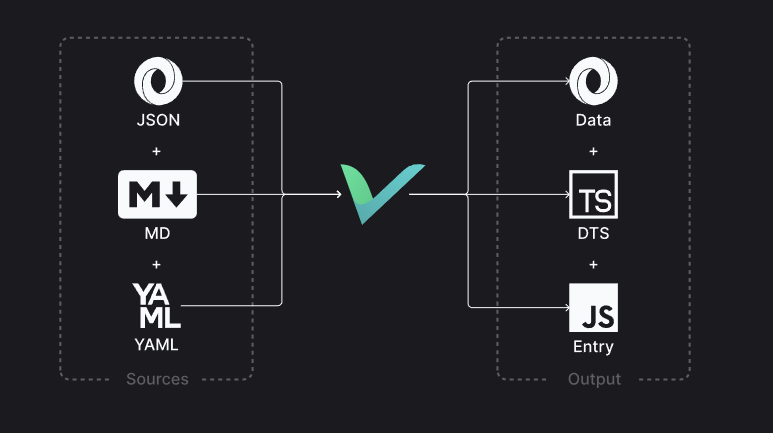

Siapa yang tidak kenal dengan Wordpress? Dia adalah salah satu CMS yang cukup populer. Kita juga bisa menggunakannya sebagai headless CMS, yang artinya proses rendering kontennya bisa kita atur sesuka hati. Bahasan kali ini berawal dari saya yang menggunakan headless CMS untuk manajemen postingan blog pada website ini. Namun, pada akhirnya beralih ke markdown file-based.

---

## Apa itu Markdown?

Markdown adalah sebuah bahasa markup yang dapat memudahkan kita dalam hal text formatting dan pada akhirnya akan ditampilkan dalam bentuk HTML. Standar markdown ini bisa berbeda-beda, seperti contoh yang diterapkan [GitHub](https://docs.github.com/en/get-started/writing-on-github/getting-started-with-writing-and-formatting-on-github/basic-writing-and-formatting-syntax) mungkin tidak akan berjalan sama persis ketika dipakai di platform lain.

## Markdown dan Next.js

Dari awal saya sudah membuat website ini menggunakan Next.js dan sudah menyediakan fitur untuk menangani file markdown. Lebih spesifiknya yang ditangani di sini bukan file markdown biasa, tapi file MDX atau markdown & JSX. Jadi kita bisa menuliskan kode markdown dan juga kode JSX pada satu file yang sama.

Jika kita mengikuti dokumentasi yang sudah ada, kita sudah bisa menuliskan kode MDX dan akan di-compile ke halaman HTML oleh Next.js dengan lancar. Lalu, kenapa masih membutuhkan library seperti Contentlayer / Velite?

---

## Content SDK

[Contentlayer](https://contentlayer.dev/) & [Velite](https://velite.js.org/) ini bisa disebut sebagai content SDK karena memudahkan kita dalam manajemen konten. Konsep keduanya juga kurang lebih sama, yaitu mengubah file source (json, markdown, yaml) menjadi file js, ts, dan json sebagai output datanya. Sehingga nanti semua file source yang kita tambahkan akan mengikuti tipe data yang sudah kita definisikan (di schema) sebelumnya.

Awalnya saya menggunakan Contentlayer, namun status project-nya saat ini sudah tidak dilanjutkan lagi seperti yang dijelaskan pada issue: [contentlayer/issues/429](https://github.com/contentlayerdev/contentlayer/issues/429#issuecomment-1731298319). Akhirnya saya coba mencari alternatif lain dan bertemu dengan Velite.

Salah satu hal yang saya suka dari Velite adalah dia menggunakan [Zod](https://zod.dev/) untuk pembuatan schema kontennya. Ada beberapa [schema tambahan](https://velite.js.org/guide/velite-schemas) juga yang mempermudah komputasi seperti mengubah gambar menjadi base64 untuk dijadikan placeholder. Ketika menggunakan Contentlayer sebelumnya, hal itu harus saya lakukan manual dengan bantuan [plaiceholder](https://plaiceholder.co/).

Beberapa schema lain yang saya pakai ada seperti `metadata` yang mengasilkan output `readingTime` untuk artikel yang saya tulis, jadi tidak perlu hitung manual lagi. Penggunaan code highlighting juga menurut saya lebih mudah dengan bantuan library [shiki](https://shiki.matsu.io/) dan bisa ditambahkan library lain yang dapat mempercantik tampilan snippet kode pada artikel yang kita tulis.

---

Pembuat Velite ini juga menyebutkan kalau dia [terinspirasi dari Contentlayer](https://velite.js.org/guide/introduction#why-not-contentlayer), jadi secara konsep sama. Tapi dengan kebutuhan yang lebih lengkap. Tidak heran juga ketika saya migrasi dari Contentlayer ke Velite ini prosesnya cukup seamless dan mudah, juga lebih dimudahkan dengan beberapa fitur yang sudah ada.

Jika kalian ingin melihat seberapa banyak kode yang berubah bisa dilihat pada pull request berikut:

<LinkPreview href="https://github.com/hendraaagil/website/pull/75" />

Lalu, ada juga pull request lain yang spesifik untuk melakukan refactor proses komputasi gambar:

<LinkPreview href="https://github.com/hendraaagil/website/pull/76" />

---

## Penutup

Cukup itu saja yang bisa saya bagikan, saat ini markdown adalah pilihan pertama ketika saya ingin menuliskan teks ataupun diagram yang dapat menggunakan [mermaid](https://mermaid.js.org/). Karena menurut saya lebih predictable daripada menggunakan WYSIWYG editor seperti yang digunakan CMS pada umumnya 😄

Sampai bertemu pada tulisan lainnya. Terima kasih 👋
