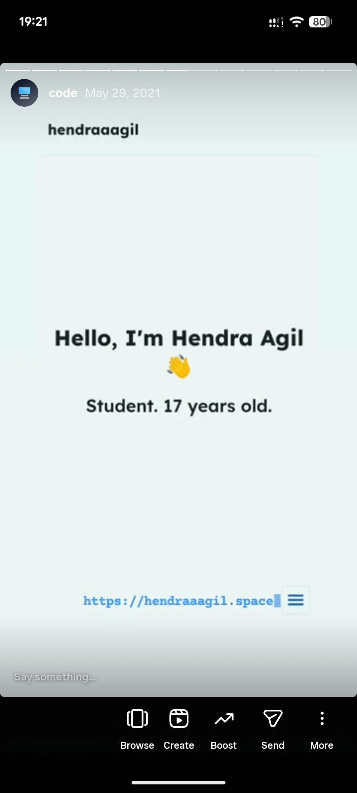
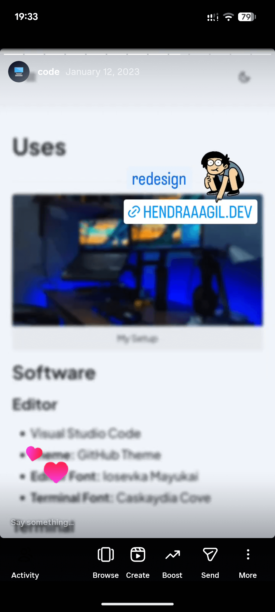
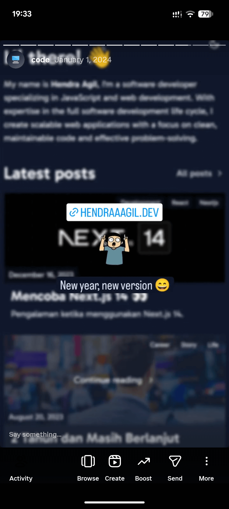
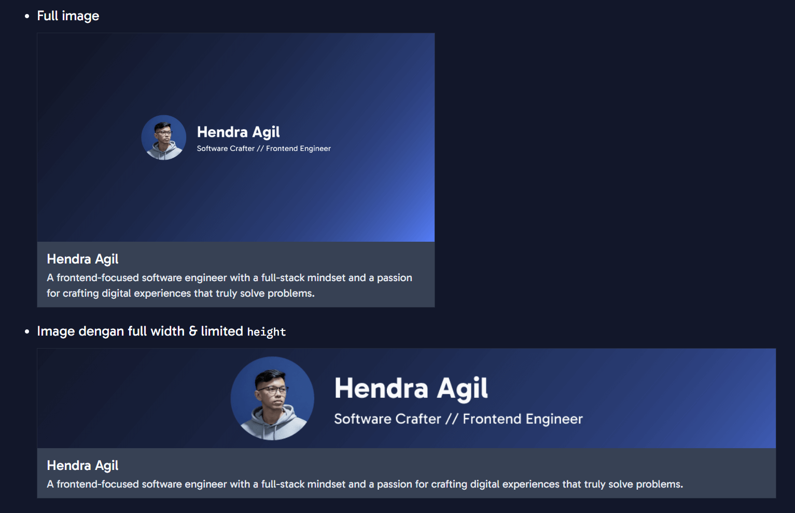

Siapa yang tidak kenal dengan Next.js? Framework React yang sangat populer dan bahkan aku sendiri memakainya untuk website personal selama kurang lebih 4 tahun terakhir ini. Tapi sekarang aku memutuskan untuk tidak menggunakan Next.js lagi dan menggunakan Astro sebagai gantinya.

---

## Kenapa Next.js?

Dulu ketika aku baru banget belajar, tentu akan memilih framework yang populer pada saat itu, dan itu adalah Next.js. Ini adalah website personal pertamaku menggunakan Next.js, Chakra UI, dan Contentful sebagai CMS-nya.

Arsipnya masih tersimpan di branch: [github.com/hendraaagil/website/tree/v2](https://github.com/hendraaagil/website/tree/v2). Yaa.. dulu belum terlalu paham versioning padahal dari versi 1 ke 2 cuma ganti sumber konten dari Contentful ke local file MDX 😅

Lalu lanjut ke versi 3, saat itu aku redesign websitenya dari 0 di tahun 2023.

Dan di tahun 2024, aku redesign lagi sama sekalian nyobain fitur-fitur baru di app router seperti yang aku tuliskan di [blog/mencoba-next-14](/blog/mencoba-next-14). Di sini aku juga mulai pakai fiturnya MDX, yaitu kita bisa buat custom component dan dipakai di konten markdown kita.

Salah satu hal keren yang aku temukan adalah bisa membuat component `LinkPreview` untuk mengambil metadata open-graph dari sebuah link, lalu di-render sebagai React component. Yang bikin merasa sangat puas adalah aku coba-coba dari ideku tanpa mencari referensi dari internet 😄

	

	

---

## Berpindah ke Astro

Sampai saat ini kebutuhan website personal bagiku hanya untuk menyimpan ~kenangan~ tulisan, project, atau flexing seperti halaman [/equipments](/equipments). Di versi sebelum ini sebenarnya juga ada yang menggunakan data dinamis seperti page views, spotify, statistik wakatime, dkk. yang menurutku sudah tidak perlu lagi.

Alasan memilih Astro karena lebih sederhana, terutama ketika deployment. Juga targetku di sini hanya akan di-deploy sebagai halaman statis aja. Sehingga aku bisa meninggalkan Vercel (YTTA) dan berpindah ke [Cloudflare Pages](https://pages.cloudflare.com/) (walau akhir-akhir ini sering down), yang penting bisa deploy tanpa biaya bulanan aja 😁

---

### Sumber belajar

Biasanya nanti akan muncul pertanyaan "belajar Astro dari mana bang?"

Oke, sebelumnya aku tidak terlalu familiar dengan Astro karena tidak ada uangnya haha, jadi belum bisa menyempatkan waktu untuk explore. Sampai akhirnya di tahun ini ada sebuah project freelance dari temanku yang minta dibuatkan sebuah website personal lengkap dengan CMS-nya.

Awalnya aku berpikir dan mencoba untuk menggunakan Wordpress, karena kata orang-orang kalau bikin website statis pakai Wordpress aja gampang. Tapi.. bagi aku yang tidak terlalu familiar dengan Wordpress, ini jadi penghambat bagiku. Karena kebutuhan desainnya sangat custom dan juga butuh fitur multi-bahasa. Mungkin bisa, tapi butuh waktu lagi untuk mempelajarinya.

Akhirnya aku coba pakai Next.js, tapi ada masalah ketika deploy di Cloudflare Pages. Aku memilih deploy di Cloudflare Pages agar dari client hanya membayar domain tahunan saja, tidak perlu bayar hosting bulanan. Karena kebutuhan traffic-nya juga tidak besar. Sekitar seminggu aku coba debug masih gagal deployment-nya, dan benar saja sekarang Next.js itu tidak bisa deploy di Cloudflare Pages.

<LinkPreview href="https://github.com/cloudflare/next-on-pages" />

CLI-nya sudah deprecated, mungkin karena memang banyak sekali bug dan dari Cloudflare sudah menyerah haha. Mereka menyarankan untuk menggunakan OpenNext yang mana itu nantinya cuma bisa deploy ke Cloudflare Worker dan aku tidak mau itu.

Akhirnya, aku terpikirkan untuk pakai Astro dan menemukan template:

<LinkPreview href="https://github.com/psephopaiktes/astro-i18n-starter" />

Dari situ aku mulai belajar dan explore Astro dari dokumentasinya langsung, karena sudah sangat lengkap dan mudah dipahami. Dan ya.. begitulah caraku belajar Astro, langsung explore dan implementasi ke use case yang nyata.

---

### Fitur yang tersedia

Astro ini punya ekosistem yang cukup luas dengan banyak dukungan integrasi baik secara resmi ataupun dari komunitas. Contohnya di project yang sempat saya sebutkan sebelumnya itu menggunakan Sanity sebagai CMS dan mereka sudah menyediakan plugin resminya.

<LinkPreview href="https://docs.astro.build/en/guides/cms/sanity/" />

Sekarang aku akan bahas fitur apa saja yang tersedia, terutama yang aku pakai di website personalku:

#### Content collections

Karena Astro ini framework yang content-based. Jadi mereka menyediakan tempat untuk konfigurasi konten yang kita punya.

<LinkPreview href="https://docs.astro.build/en/guides/content-collections/" />

Ini mempermudah bagiku karena tidak perlu lagi cari library untuk konfigurasi konten seperti Velite / Contentlayer, seperti yang aku bahas di [/blog/migrasi-ke-velite](/blog/migrasi-ke-velite).

#### MDX

Kita bisa menggunakan MDX sebagai sumber konten selain dari Markdown biasa. Sudah pasti ini akan sangat mempermudah aku untuk migrasi karena tidak perlu mengubah isi dari kontennya. Dan juga komponen `LinkPreview` masih bisa dipakai seperti biasa karena component Astro berjalan di server ketika build, tidak perlu directive `'use server'` seperti ketika menggunakan component React.

#### Dynamic open graph

Salah satu fitur yang aku suka adalah open graph yang dinamis mengikuti konten dari halaman yang dituju. Di sini aku menggunakan [Astro static file endpoint](https://docs.astro.build/en/guides/endpoints/#static-file-endpoints) dengan menggunakan [Satori](https://github.com/vercel/satori) untuk konversi dari kode JSX ke SVG dan dikonversi lagi dari SVG ke PNG menggunakan [@resvg/resvg-js](https://github.com/thx/resvg-js).

Dan ternyata, logic ini sama persis dengan library [@vercel/og](https://www.npmjs.com/package/@vercel/og) yang dipakai sama [ImageResponse](https://nextjs.org/docs/app/api-reference/functions/image-response) di Next.js. Aku baru sadar saat sedang menulis post ini, jadi aku ganti aja langsung di commit: [df7df0e](https://github.com/hendraaagil/website/commit/df7df0e671457f9b6f33e52ee28f2a33f1620da4) karena perubahannya juga sangat mudah.

Sepertinya aku dulu pernah eksplorasi di [github.com/hendraaagil/astro-dynamic-og](https://github.com/hendraaagil/astro-dynamic-og) dan kalau tidak salah ImageResponse dari `@vercel/og` ini tidak compatible sama return API punya Astro. Entahlah apa sudah diubah atau gimana, tapi aku ganti aja ke `@vercel/og` karena fiturnya lebih lengkap dan tinggal pakai. Tidak perlu buat dari awal.

#### View transitions

Fitur ini memanfaatkan API yang cukup baru, yaitu [View Transition API](https://developer.mozilla.org/en-US/docs/Web/API/View_Transition_API). Jadi, di sini kita bisa dengan mudah untuk menambahkan transisi antar halaman. Tapi tradeoff-nya ketika kita menggunakan fitur ini akan mengubah website kita menjadi mode "SPA" karena memanfaatkan JavaScript untuk implementasinya.

<LinkPreview href="https://docs.astro.build/en/guides/view-transitions/" />

#### Internationalization

Ini tidak aku pakai di website personal, tapi sangat berguna ketika butuh website yang perlu fitur multi-bahasa. Mereka sudah menyediakan konfigurasinya, tinggal kita pakai dan sesuaikan saja.

<LinkPreview href="https://docs.astro.build/en/guides/internationalization/" />

#### Dan masih banyak lagi

Tentu kalau aku bahas semua fitur Astro, post ini akan jadi sangat panjang. Juga belum semua fitur dari Astro aku pakai dan deep dive ke dokumentasinya. Jadi, kalau kalian penasaran dengan fitur lain dari Astro bisa ke dokumentasinya secara langsung:

<LinkPreview href="https://docs.astro.build/en/getting-started/" />

---

## Penutup

Biasanya di website personal versi sebelumnya, ada beberapa orang yang fork repository github website ini dan dimodifikasi untuk keperluan mereka sendiri. Jadi, untuk memudahkan hal tersebut di versi yang sekarang aku sudah buat template-nya dan bisa kalian pakai secara gratis. Atau jika kalian ingin menambahkan fitur juga boleh banget, bisa langsung bikin pull request atau issue kalau mau diskusi dulu.

<LinkPreview href="https://github.com/aglabsid/ctros" withImage fullImage />

Terima kasih 🤘
